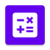
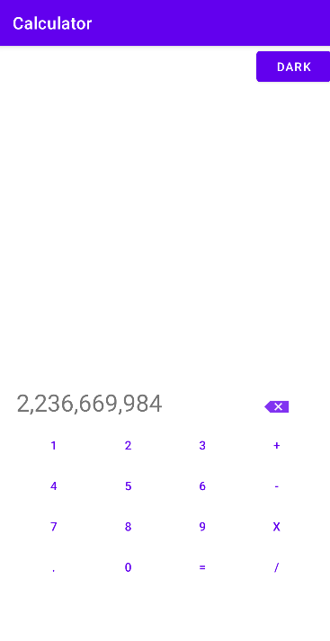
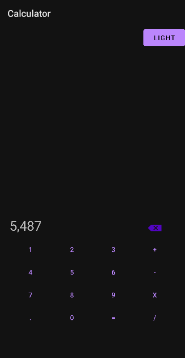

# An example calculator app for Android

A simple calculator app for Android with number buttons and buttons for four common arithmetic operations.

Features include

* Handles very large numbers accurately
* Light and dark view modes
* View mode preference is saved
* Support for English and French

## Screenshots

 

https://user-images.githubusercontent.com/1508862/215797633-0b094d26-966a-4e58-a54c-19fdc52952f5.mp4

